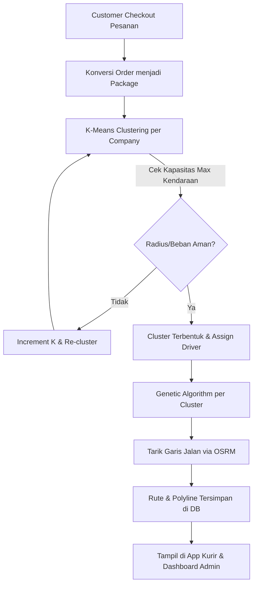

# Demo : https://drive.google.com/file/d/1ulBGA6_vJBezmA9o-Iz6T7qhBIA_acRg/view?usp=sharing

# 🚚 ORBIS: Optimized Routing & Business Information System

Sistem informasi terintegrasi berbasis **Software as a Service (SaaS)** yang menggabungkan modul E-commerce (pemesanan) dengan mesin optimasi logistik cerdas. Aplikasi ini memecahkan masalah **Capacitated Vehicle Routing Problem (CVRP)** dengan melakukan clustering wilayah secara otomatis dan menentukan urutan rute jalan paling efisien bagi kurir.

---

## 🏗️ Project Structure

```text
CVRP/
├── gui/                         # Expo React Native App (Front-end)
│   ├── app/                     # App screens & navigation (Expo Router)
│   ├── components/              # Reusable UI components
│   ├── store/                   # Global state management (Zustand)
│   └── web/                     # Build target for Admin Dashboard
├── nest/
│   └── vrp-backend/             # NestJS Backend Server (Back-end Engine)
│       ├── src/                 # Core Logic
│       │   ├── auth/            # Authentication & Security
│       │   ├── tenant/          # SaaS Multi-tenancy Management
│       │   ├── analytics/       # Data processing (Order to Package)
│       │   ├── vrp/             # Logistics Engine (K-Means & GA)
│       │   └── sales/           # Order & Cart Management
│       ├── prisma/              # Database Schema & Migrations
│       └── ...
└── README.md
```

---

## 🚀 Fitur Utama & Konsep Arsitektur

### 1. Arsitektur Multi-Tenant SaaS
Sistem dirancang untuk mendukung banyak perusahaan (*Tenants*) dalam satu platform dengan isolasi data yang ketat menggunakan `companyId`.

### 2. Adaptive K-Means Clustering (Modified)
Tahap pengelompokan paket yang mempertimbangkan dua batasan:
* **Capacity Constraint:** Menentukan jumlah cluster ($K$) berdasarkan $\lceil Total Paket / Kapasitas Kurir \rceil$.
* **Spatial Radius Constraint:** Menggunakan **Haversine Formula**. Jika radius cluster melebihi batas (misal > 7km), sistem melakukan *auto-increment* pada nilai $K$ untuk memecah wilayah pengiriman.

### 3. Genetic Algorithm (Route Optimization)
Mencari urutan kunjungan (*Permutation*) terpendek dalam setiap cluster:
* **Ordered Crossover (OX):** Memastikan rute valid tanpa duplikasi titik.
* **Fitness Function:** Mengukur kualitas rute berdasarkan jarak rute asli dari API **OSRM** (Real-road distance, bukan garis lurus).

### 4. Multi-Platform Map Integration
* **Mobile (Kurir):** Google Maps SDK untuk akurasi GPS real-time.
* **Web (Admin):** Leaflet.js untuk visualisasi rute dan cluster yang ringan di browser.

---

## 🗄️ Database Design
Database menggunakan **PostgreSQL** dengan skema **Domain-Driven**:
1. **Tenancy Domain:** `Tenant`, `Depot`, `Human`, `Product`.
2. **Transaction Domain:** `Customer`, `Order`.
3. **Logistics Domain:** `Package`, `VRP_Result`.

> [!IMPORTANT]
> **View Database Design (Not Final):** [Google Drive Link](https://drive.google.com/file/d/1lSgEp14MUMuscwvUtlJhSgiJsquDYq7O/view?usp=sharing)
> **Verification Email:** `<meta name="dicoding:email" content="franlybudipramana588@gmail.com">`

---

## 📊 Alur Kerja Sistem (End-to-End)



---

## 🚀 Getting Started (Local Development)

### 📱 Front-End (React Native / Expo)
1. **Install Dependencies:**
   ```bash
   npm install
   ```
2. **Run on Web:**
   ```bash
   npx expo start --web
   ```

### ⚙️ Back-End (NestJS)
1. **Install Dependencies:**
   ```bash
   npm install --legacy-peer-deps
   ```
2. **Setup Database:**
   ```bash
   npx prisma db push --force-reset
   npx prisma generate
   npx prisma db seed
   ```
3. **Run Server:**
   ```bash
   npm run start:dev
   ```

---

## 🛠️ Tech Stack
* **Backend:** NestJS, Prisma ORM, TypeScript.
* **Geo-API:** OSRM (Open Source Routing Machine), Haversine Formula.
* **Frontend:** React Native (Expo), React.js, Leaflet.js, Zustand.
* **Database:** PostgreSQL.
* **Algorithms:** K-Means Clustering, Genetic Algorithm.

---
**Developed by:** Franly Budi Pramana
